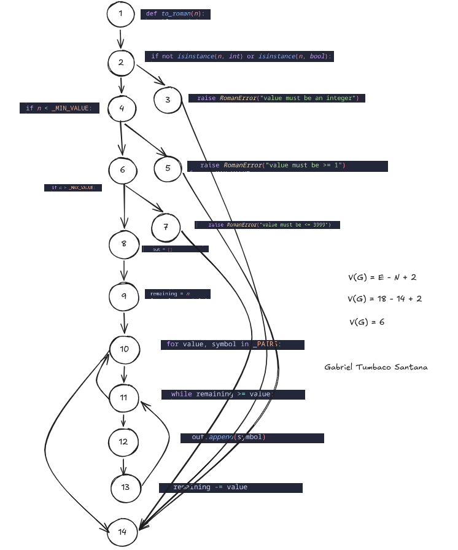
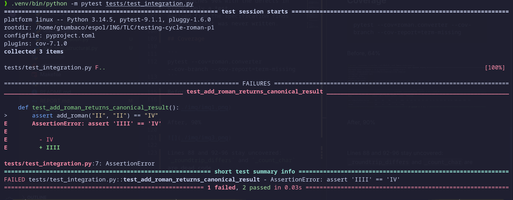
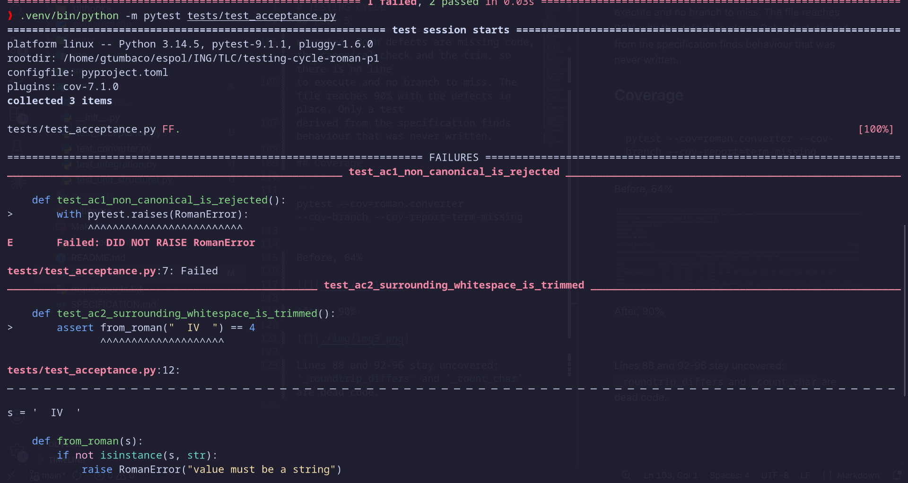
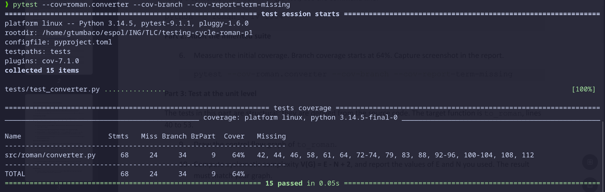
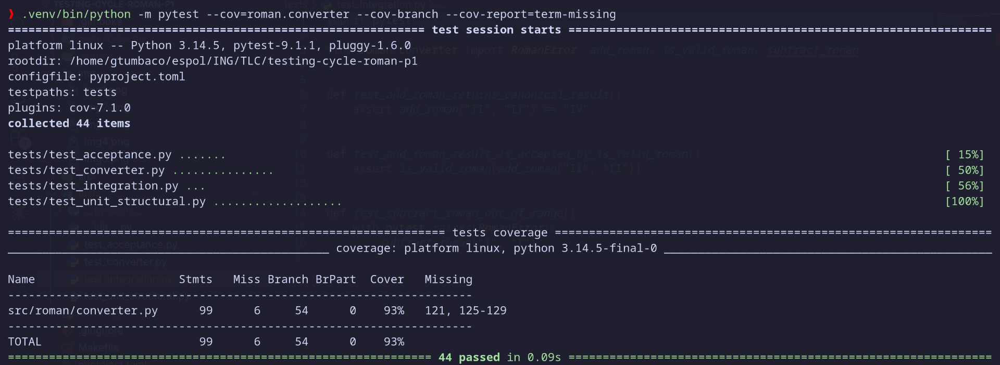

# TESTING CYCLE

Gabriel Tumbaco Santana

## Part 1

Fork cloned, virtual environment created, package installed, inherited suite run: 15 passed.

## Part 2

Initial branch coverage of `src/roman/converter.py` measured: 64%, see the Coverage section.

## Part 3

### 9. Control flow graph of `to_roman`



### 10. Cyclomatic complexity

```
E = 18
N = 14

V(G) = E - N + 2
V(G) = 18 - 14 + 2
V(G) = 6
```

### 11. Basis set

```
P1: 1 - 2 - 3 - 14
P2: 1 - 2 - 4 - 5 - 14
P3: 1 - 2 - 4 - 6 - 7 - 14
P4: 1 - 2 - 4 - 6 - 8 - 9 - 10 - 14
P5: 1 - 2 - 4 - 6 - 8 - 9 - 10 - 11 - 10 - 14
P6: 1 - 2 - 4 - 6 - 8 - 9 - 10 - 11 - 12 - 13 - 11 - 10 - 14
```

### 12. Definition-use table

| definition - use pair<br>start line -> end line | variable(s)<br>c-use | variable(s)<br>p-use |
|---|---|---|
| 1 -> 2 | | n |
| 1 -> 4 | | n |
| 1 -> 6 | | n |
| 1 -> 9 | n | |
| 8 -> 12 | out | |
| 8 -> 14 | out | |
| 9 -> 11 | | remaining |
| 9 -> 13 | remaining | |
| 10 -> 11 | | value |
| 10 -> 12 | symbol | |
| 10 -> 13 | value | |
| 13 -> 11 | | remaining |
| 13 -> 13 | remaining | |

Line 13 is a c-use and a definition of `remaining`, so it creates 13 -> 11 and 13 -> 13.

### 13. Unit tests

`tests/test_unit_structural.py`, one test per path of the basis set.

## Part 4

Test: `tests/test_integration.py`.



Defect: `_PAIRS` has `(5, "IV")` instead of `(4, "IV")`, so `to_roman(4)` returns `IIII`.

The unit tests pass because `from_roman` is correct on its own and `to_roman` is never tested
with a value that leaves a remainder of 4. That value only appears inside `add_roman`.

## Part 5

Tests: `tests/test_acceptance.py`.

AC1, section 4

```
Given the string IIII
When it is converted with from_roman
Then RomanError is raised, because the canonical form of 4 is IV
```

AC2, section 3

```
Given the string "  IV  " with surrounding blanks
When it is converted with from_roman
Then the result is 4, because only the ends are trimmed
```

AC3, section 6

```
Given the input None
When it is checked with is_valid_roman
Then the result is False and nothing is raised
```

Result: AC1 and AC2 fail, AC3 passes.



Coverage cannot reveal them because both defects are missing code, the canonical check and
the trim. There is no line to execute and no branch to miss, so the file reaches 90% with the
defects in place.

## Part 6

Three defects fixed, one commit each: the `IV` pair in `_PAIRS`, the trim in `from_roman`,
and the canonical form validation of section 4. Suite green, 15 inherited tests unmodified.

## Coverage

```
pytest --cov=roman.converter --cov-branch --cov-report=term-missing
```

Before, 64%, 15 passed



After, 93%, 44 passed



The uncovered lines are `_roundtrip_differs` and `_count_char`, dead code.

## Library

Roman numeral conversion library. Supports integers 1 to 3999 with subtractive notation.
Invalid input raises `RomanError`.

```bash
python3 -m venv .venv && source .venv/bin/activate
pip install -r requirements.txt -e .
pytest
```

```python
from roman.converter import to_roman, from_roman

to_roman(1994)         # 'MCMXCIV'
from_roman('MCMXCIV')  # 1994
```

| Function | Description |
|---|---|
| `to_roman(n)` | Integer to roman numeral |
| `from_roman(s)` | Roman numeral to integer |
| `is_valid_roman(s)` | Whether a string is a valid canonical roman numeral |
| `add_roman(a, b)` | Sum of two roman numerals |
| `subtract_roman(a, b)` | Difference of two roman numerals |

```
src/roman/converter.py         conversion library
src/roman/__main__.py          command line entry point
tests/test_converter.py        inherited test suite
tests/test_unit_structural.py  unit level, structural
tests/test_integration.py      integration level
tests/test_acceptance.py       acceptance level
SPECIFICATION.md               functional specification
```
